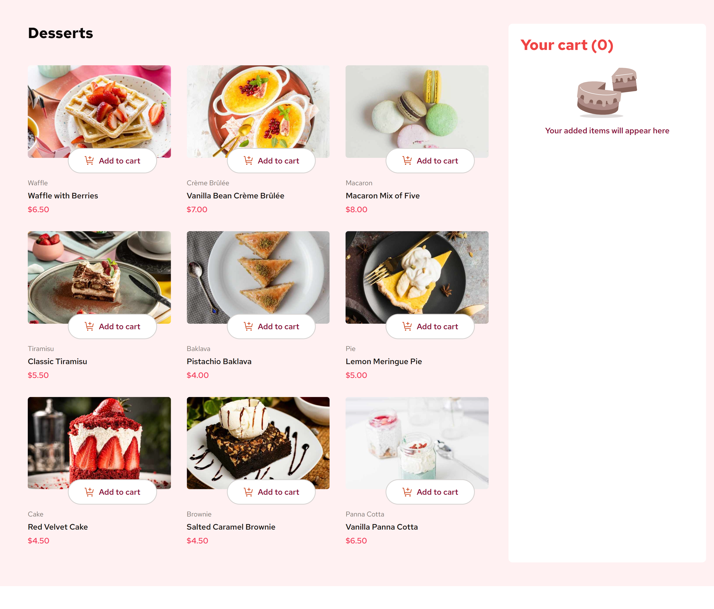

# Frontend Mentor - Product list with cart solution

This is a solution to the [Product list with cart challenge on Frontend Mentor](https://www.frontendmentor.io/challenges/product-list-with-cart-5MmqLVAp_d). Frontend Mentor challenges help you improve your coding skills by building realistic projects.

## Table of contents

- [Overview](#overview)
  - [The challenge](#the-challenge)
  - [Screenshot](#screenshot)
  - [Links](#links)
- [My process](#my-process)
  - [Built with](#built-with)
  - [What I learned](#what-i-learned)
  - [Continued development](#continued-development)
- [Author](#author)

## Overview

### The challenge

Users should be able to:

- Add items to the cart and remove them
- Increase/decrease the number of items in the cart
- See an order confirmation modal when they click "Confirm Order"
- Reset their selections when they click "Start New Order"
- View the optimal layout for the interface depending on their device's screen size
- See hover and focus states for all interactive elements on the page

### Screenshot




### Links

- Solution URL: [Solution URL here](https://your-solution-url.com)
- Live Site URL: [Live site URL here](https://your-live-site-url.com)

## My process

### Built with

- Semantic HTML5 markup
- CSS custom properties
- Flexbox
- CSS Grid
- Mobile-first workflow
- [React](https://reactjs.org/) - JS library
- [Tailwind CSS](https://tailwindcss.com/) - For styles

### What I learned

This challenge has been eye opener for many areas for learning React. Have used the following concepts in this challenge.

- React Router with Data Loading using "loader".
- Redux tool kit.
- Using the same Button component for different types of button.

Why I used the "loader" feature of the React Router.

- It helps to fetch the menu data easily, First I fetched the menu data by creating a json-server and used an API call to fetch the data from the local server. But I got error while uploading to the github. I have to learn still how to run the server from github. When fetching from API, the loader data is easily fetched and can be mentioned in the createBrowserRouter element itself.

How I used Redux toolkit in this challenge is mentioned below.

1. Installing the toolkit from npm

2. Creating a slice file. In that

- first initialState needs to be mentioned
- createSlice method is called to create a slice
- In that give the name,reducers function,initialState and everything
- Export the reducer function and the slice variable itself

3. Create store.js file

- using ConfigureStore method we mention the reducer created in the userSlice file and creating the store where the actions take place.

  4.Connecting the store to the react application.

- In the main.jsx file, using the "Provider" from redux toolkit, we mention the store, we created in the store.js file.

```html
<Provider store="{store}">
  <App />
</Provider>
```

5. Using the useSelector hook we can get the state variables to the code.

To delete the item from the cart when the quantity is decreased to 0, I used the following code

```js
if (item.quantity === 0) cartSlice.caseReducers.deleteItem(state, action);
```

### Continued development

I have to learn how to run a server from the github. I tried creating a github page that just displays the contents of the data.json but it was giving me CORS error. I have to learn how to eliminate this error and use the page contents.

## Author

- Frontend Mentor - [@Memeena](https://www.frontendmentor.io/profile/Memeena)
- Twitter - [@Mekrish18](https://www.twitter.com/Mekrish18)
